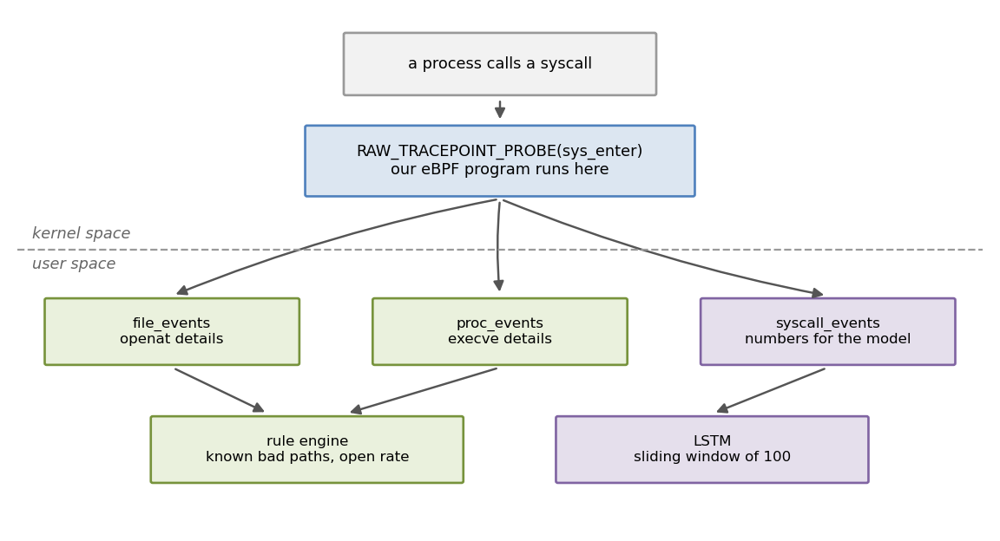
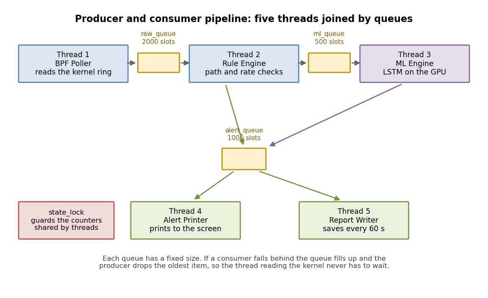
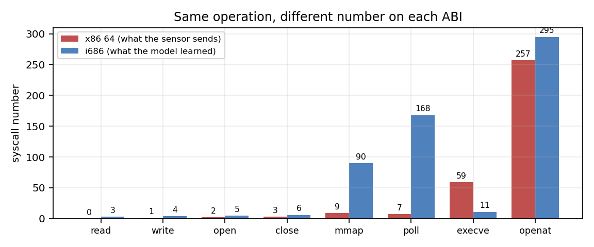

# BPF Based Live Resource Thief Detector

<p>&nbsp;&nbsp;</p>

A tool that watches every system call on your computer and warns you when a
program starts acting like it is stealing your files.

---

## Video Demonstration

[](https://youtu.be/PEDQ-geG7GE)

*Please Click the image to watch the project demonstration on YouTube.*

---

## The idea

A program cannot do anything useful on its own. To read a file, it must ask
the kernel. That request is called a **system call**.

This is useful for security. A program can change its name and pretend to be
harmless, but it cannot avoid asking the kernel. If it wants to steal your
password file, it has to call `openat` on that file. So if we watch the system
calls, we see what a program is really doing.

---

## What it catches

| Behaviour | Example |
|---|---|
| Reading secret files | Opening `/etc/shadow` or SSH keys |
| Sweeping the disk | Opening 500 files in one second |
| Starting suspicious programs | Launching `ncat` or `socat` |
| Odd patterns of calls | Attacks the rules were not written for |

The first three are caught by rules. The last one is caught by a neural
network trained on a public dataset of real Linux attacks.

---

## Operating systems concepts that I used


| Concept | Where to look |
|---|---|
| System calls | [ebpf_sensor.c](src/ebpf_sensor.c), hooks `sys_enter` |
| Kernel space and user space | C code in the kernel, Python outside it |
| CPU calling convention | Reads arguments from the RDI and RSI registers |
| Kernel to user communication | Three perf ring buffers |
| Kernel data structures | Two `BPF_HASH` maps for per process counters |
| Threads | [detector.py](src/detector.py) lines 457 to 461 |
| Producer and consumer | Three bounded queues, lines 54 to 56 |
| Locks | One `threading.Lock`, line 59 |
| Thread coordination | `threading.Event` for clean shutdown |
| Buffering and overflow | Burst sampling in the kernel |

---

## How to run it

```bash
cd ~/Downloads/Project
bash run.sh
```

Then open **http://localhost:5000** in a browser.

It needs your password because reading system calls requires root.

**The first 90 seconds are learning(calibration) time.** The tool watches machine
quietly to find out what normal looks like here. It will not raise ML alerts
during this period. This is on purpose and explained further down.

**To test it**, open a second terminal and pretend to be an attacker:

```bash
venv/bin/python3 src/simulate_thief.py snoop    # reads /etc/passwd
venv/bin/python3 src/simulate_thief.py rapid    # opens 100 files quickly
```

**Terminal only version** if you want to see the five threads working:

```bash
sudo venv/bin/python3 src/detector.py
```

**No password?** Run it without `sudo` and it switches to demo mode, replaying
real attacks from the dataset so you can still see the model work:

```bash
venv/bin/python3 src/dashboard.py
```

---

## How it works



A small program is loaded into the Linux kernel using eBPF. The kernel checks
it first so it cannot crash anything, then runs it every time any program makes
a system call.

Two system calls matter most:

- **`openat`** tells us which file was opened
- **`execve`** tells us a new program was started

The kernel writes these events into ring buffers. The Python program reads them
out and decides what to do.

### A problem that I hit

The normal way to read the file name from a system call did not compile on
kernel 7.0. So instead I read it straight from the CPU registers. On a 64 bit
machine the first argument sits in the RDI register and the second in RSI. This
works on every kernel version because the CPU rule never changes.

---

## Why Threads are needed



The first version was one simple loop. Read an event, check it, print it,
repeat. It did not work, and the reason is a good lesson.

Printing to a screen is slow. While the program was printing, nobody was
reading the kernel buffer. The buffer filled up and the kernel threw events
away.

**Being slow did not make the answers late. It made them wrong**, because the
data was already gone.

So the program was split into five threads:

| Thread | Job |
|---|---|
| 1 | Read the kernel buffer, nothing else |
| 2 | Check the rules |
| 3 | Run the model on the GPU |
| 4 | Print alerts |
| 5 | Save a report every minute |

Three choices made this work:

**Queues have a size limit.** If a slow thread falls behind, we throw away the
oldest event instead of waiting. Losing one old event is much better than
freezing the thread that reads the kernel.

**One lock for everything shared.** Using a single lock instead of many keeps
the code simple and makes deadlock impossible.

**A flag instead of sleep.** The report thread waits on an event flag, not
`sleep`. So pressing Control C stops everything at once instead of taking a
full minute.

---

## Too much data

Watching every system call produces **more than 100,000 events per second**.
Python cannot read that fast, so the kernel buffer overflowed and most events
were lost.

We could not simply keep every tenth event, because the model needs calls that
come one after another. Skipping breaks the order it learned.

So the kernel now sends **128 events in a row, then stays quiet for 896**. Each
burst is a real unbroken sequence, long enough for the model, but only one
eighth of the traffic. After this change, zero events were lost.

---

## A bug worth knowing about



The model was trained on a dataset recorded in 2011 on a 32 bit computer. Our
sensor runs on a 64 bit computer. Both use numbers to identify system calls,
but **they use different numbers for the same thing**.

On my machine `read` is 0. In the dataset `read` is 3. So every event reached
the model meaning something completely different.

Nothing crashed, because both numbers were valid. The scores were just
nonsense. We fixed it with a translation table of 376 entries that matches the
two systems by name.

| | Score gap between normal and attack |
|---|---|
| Before the fix | 0.16 |
| After the fix | 0.77 |

---

## Why it learns machine first

The model knows what normal looked like in 2011. Modern software behaves very
differently, so at first almost everything looked like an attack.

Raising the alert level by hand does not help when normal activity already
scores 99 percent. So the tool spends its first 90 seconds watching quietly,
learning what is normal **on my machine**, and then sets the alert level just
above that.

False alarms dropped from **87 percent to 3 percent**.

---

## Results

| What we measured | Before | After |
|---|---|---|
| Events lost per second | 45,646 | 0 |
| Model runs per 1000 calls | 901 | 19 |
| Score gap, normal vs attack | 0.16 | 0.77 |
| False alarms | 87% | 3% |
| Attacks caught | 93% | 93% |

The last row matters most. Everything we did to reduce noise was checked
against detection, and detection stayed the same.

---

## Files

```
Project/
├── assets/
├── src/
│   ├── ebpf_sensor.c        the program that runs inside the kernel
│   ├── dashboard.py         web version with the live interface
│   ├── detector.py          terminal version, five threads
│   └── simulate_thief.py    fake attacker for testing
├── ml/
│   ├── 01 to 04 notebooks   dataset, training, and testing
│   ├── live_predictor.py    scores processes while running
│   └── saved_model/         the trained model
└── run.sh                   starts everything
```

The five threads are in `detector.py`. The web version uses fewer threads
because Flask handles that part itself.

Notebooks are explained in [ml/README.md](ml/README.md).

---

**This things are needed:** BCC (`python3-bpfcc`), Flask, PyTorch with CUDA, scikit-learn,
joblib, and the [ADFA LD dataset](https://research.unsw.edu.au/projects/adfa-ids-datasets).
